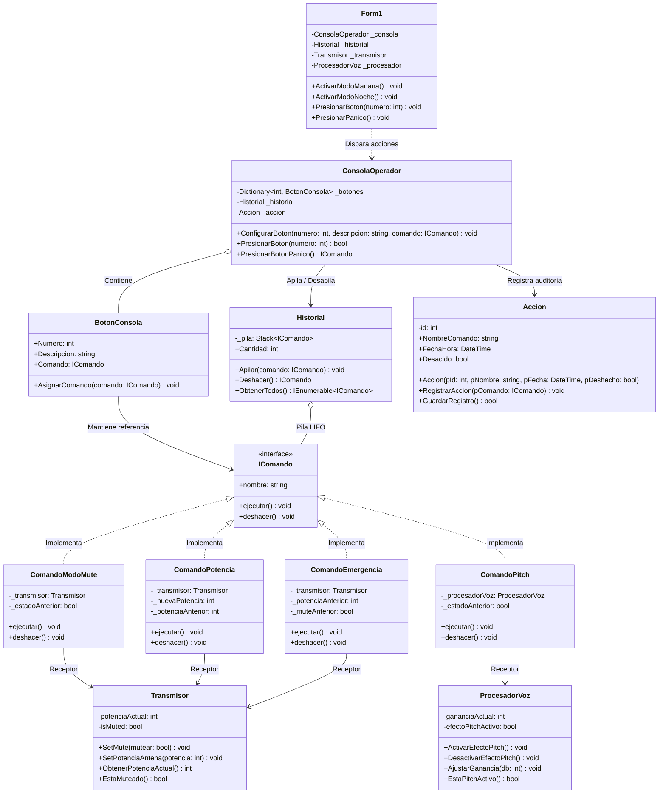

# Patrón de Diseño: Command (Comando)

> [!NOTE]
> Documento técnico y conceptual sobre el patrón de comportamiento **Command**, estructurado según los principios de diseño de software orientado a objetos y buenas prácticas (GoF).

---

## 2.1. Teoría y Funcionalidad del Patrón Command

El patrón **Command** (Comando) pertenece a la categoría de **patrones de comportamiento** del *Gang of Four* (GoF). Su propósito fundamental es **encapsular una solicitud o acción como un objeto independiente**, conteniendo toda la información necesaria para ejecutarla, retrasarla, ponerla en cola o revertirla. Al convertir las operaciones en objetos de primera clase, permite parametrizar a los emisores (invocadores) con diferentes solicitudes sin que estos conozcan la identidad ni la implementación de los objetos que las reciben (receptores).

### La Problemática: Acoplamiento Directo y Rigidez Operativa
En el diseño tradicional de interfaces y sistemas orientados a objetos, es habitual que los elementos emisores de acciones (como botones de una interfaz gráfica, atajos de teclado, temporizadores o elementos de menú) invoquen directamente los métodos de los objetos que contienen la lógica de negocio o manipulan el hardware.

Este enfoque presenta serias limitaciones de diseño:
1. **Fuerte acoplamiento entre emisor y receptor**: Si un botón en pantalla invoca directamente `transmisor.SetMute(true)`, la interfaz gráfica queda atada a la clase concreta del receptor. Si la clase del receptor cambia o se reemplaza, la interfaz debe modificarse.
2. **Duplicación de código por múltiples vías de invocación**: Si una misma operación puede dispararse desde un botón visual, un atajo de teclado (`1..4`), un pedal de suelo (`Tecla P`) o una consola remota, el código de invocación y parametrización se duplica en cada punto de interacción.
3. **Rigidez ante reconfiguraciones dinámicas**: Cuando el comportamiento de los controles debe variar según el contexto (por ejemplo, perfiles operativos como *Turno Mañana* vs. *Turno Noche*), la solución ingenua recurre a estructuras condicionales masivas (`if/else` o `switch`), violando el **Principio de Abierto/Cerrado (OCP)** y el **Principio de Responsabilidad Única (SRP)**.
4. **Ausencia de soporte estructurado para Deshacer (Undo / Rollback)**: Revertir acciones requiere recordar el estado anterior y la operación inversa exacta. Sin una abstracción de comando, la interfaz gráfica se ve forzada a gestionar variables de estado histórico de los subsistemas técnicos, degradando la cohesión del código.

### La Solución Funcional: Encapsulación de Acciones como Objetos
El patrón Command resuelve esta problemática separando estrictamente las responsabilidades mediante la intervención de **cuatro participantes clave**:

```
 [Cliente / UI] ──(Configura)──> [Invocador / Consola]
                                         │
                                         ▼  (Dispara ejecutar())
                                [Contrato: IComando]
                                         │
                     ┌───────────────────┴───────────────────┐
                     ▼                                       ▼
         [Comando Concreto A]                    [Comando Concreto B]
                     │                                       │
                     ▼  (Delega la acción)                   ▼  (Delega la acción)
          [Receptor: Transmisor]                   [Receptor: Procesador DSP]
```

1. **Cliente (`Form1`)**: Instancia los receptores de negocio, crea los comandos asignándoles sus respectivos receptores y parametriza los slots de los invocadores.
2. **Invocador (`ConsolaOperador`, `BotonConsola`)**: Es responsable de iniciar la solicitud cuando el usuario interactúa. Solo conoce la interfaz abstracta `IComando`; al activarse, simplemente ejecuta `comando.ejecutar()` sin saber qué receptor está operando por detrás.
3. **Contrato de Comando (`IComando`)**: Declara los métodos universales `ejecutar()` y `deshacer()`, además de una propiedad descriptiva (`nombre`).
4. **Comandos Concretos (`ComandoModoMuteS`, `ComandoPitchS`, `ComandoPotenciaS`, `ComandoEmergenciaS`)**: Implementan el contrato `IComando`. Almacenan una referencia al receptor específico, los argumentos de la operación y el **estado anterior** del receptor antes de ser modificado.
5. **Receptores (`Transmisor_BLL`, `ProcesadorVoz_BLL`)**: Contienen la lógica técnica real del dominio (ajuste de potencia RF, conmutación de silencio, procesamiento de señal digital de audio).

### Mecánica de Reversibilidad (Undo / Historial LIFO)
La encapsulación de acciones como objetos habilita naturalmente la implementación de un sistema de **deshacer multinivel**. Cada vez que el invocador dispara un comando con éxito, lo apila en una estructura de datos LIFO (`Stack<IComando>` dentro de `Historial`). 

Cuando se solicita una reversión (por ejemplo, pulsando `Ctrl+Z` o el botón de pánico):
- La consola desapila (`Pop()`) el comando superior del historial.
- Invoca su método `deshacer()`.
- El comando concreto aplica la operación inversa sobre el receptor utilizando el estado histórico que había preservado previamente, restaurando el hardware a su condición exacta.

---

## 2.2. Ventajas y Desventajas de Command

El análisis del patrón Command evalúa el equilibrio entre el desacoplamiento arquitectónico, la flexibilidad operativa y la proliferación de clases concretas.

### Ventajas

| Ventaja | Descripción |
| :--- | :--- |
| **Desacoplamiento Total (SRP)** | Desvincula por completo las clases que inician una operación (interfaz, botones, temporizadores) de las clases que ejecutan la lógica técnica real (receptores de negocio o hardware). |
| **Principio Abierto / Cerrado (OCP)** | Permite incorporar nuevos comandos y operaciones en el sistema sin necesidad de modificar el código existente de los invocadores ni de los receptores. |
| **Soporte Nativo para Deshacer y Rehacer (Undo / Redo)** | Dado que cada comando conserva el contexto y el estado previo necesario para revertir su acción, es posible estructurar pilas de reversión y repetición de forma limpia y transparente. |
| **Reconfiguración Dinámica en Tiempo de Ejecución (Hot-Swap)** | Los invocadores pueden ser parametrizados con distintos comandos en cualquier momento (por ejemplo, alternando perfiles operativos como *Turno Mañana* y *Turno Noche* con un solo clic). |
| **Composición en Macrocomandos y Transacciones** | Facilita la creación de comandos compuestos (*Macro Commands*) que orquestan secuencias coordinadas de múltiples subcomandos como una única unidad lógica. |
| **Encolamiento y Ejecución Diferida** | Al ser objetos autónomos, los comandos pueden almacenarse en colas de mensajes, planificarse para ejecución diferida o transmitirse para ejecución remota. |

### Desventajas

| Desventaja | Descripción |
| :--- | :--- |
| **Proliferación de Clases Concretas** | Cada operación o variante de acción específica requiere definir una nueva clase que implemente `IComando`, lo que incrementa notablemente la cantidad total de archivos y tipos en el proyecto. |
| **Capa Adicional de Indirección** | Introduce intermediarios entre quien solicita una acción y quien la ejecuta, lo que puede aumentar ligeramente la curva de aprendizaje y la complejidad del trazado durante la depuración (*debugging*). |
| **Consumo de Memoria en Pilas de Historial Extensas** | Almacenar comandos ejecutados que retienen referencias o copias del estado previo de receptores complejos puede requerir un control del tamaño máximo de la pila en sistemas de alta exigencia de recursos. |

---

## 2.3. Diagrama de Clases General Command

### Vista Previa del Diagrama (Enterprise Architect)
El modelo oficial se encuentra generado y guardado en [Command_EJ2.EAP](file:///c:/Users/Danie/Desktop/GIT/Command_EJ2/Diagrama/Command_EJ2.EAP).


### Diagrama UML en Mermaid



### Componentes Principales del Patrón

1. **`IComando`**: Interfaz común que unifica el contrato de ejecución (`ejecutar()`) y reversión (`deshacer()`) de todas las acciones del sistema.
2. **Comandos Concretos (`ComandoModoMute`, `ComandoPitch`, `ComandoPotencia`, `ComandoEmergencia`)**: Objetos intermediarios que encapsulan las llamadas hacia sus respectivos receptores y capturan el estado previo para garantizar la reversión.
3. **Invocadores (`ConsolaOperador`, `BotonConsola`)**: Elementos que canalizan las interacciones del operador y desencadenan la ejecución del comando asociado sin conocer detalles de la lógica de audio.
4. **Receptores (`Transmisor`, `ProcesadorVoz`)**: Clases de dominio que ejecutan el trabajo técnico especializado sobre los subsistemas de transmisión y modulación.
5. **Historial (`Historial`)**: Estructura de pila LIFO encargada de almacenar los comandos ejecutados para brindar soporte a la operación de rollback.
6. **Entidad General Unificada (`Accion`)**: Clase integral que unifica en una única estructura los atributos de auditoría (`id`, `NombreComando`, `FechaHora`, `Desacido`) junto con sus métodos operativos (`RegistrarAccion`, `GuardarRegistro`).
