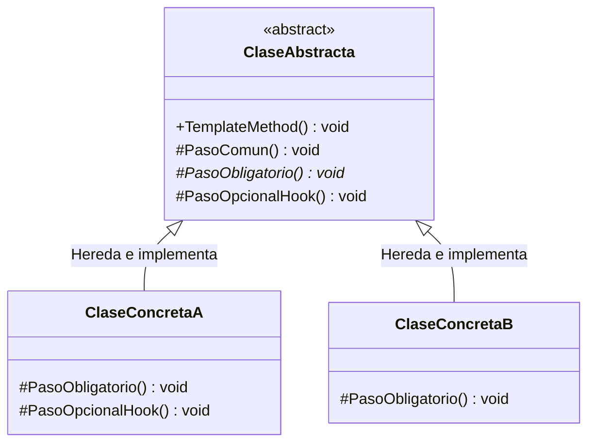

# Patrón de Diseño: Template Method (Método Plantilla)

> [!NOTE]
> Documento técnico y conceptual sobre el patrón de comportamiento **Template Method**, estructurado según los principios de diseño de software orientado a objetos y buenas prácticas (GoF).

---

## 1.1. Teoría y Funcionalidad del Patrón Template

El patrón **Template Method** (Método Plantilla) pertenece a la categoría de **patrones de comportamiento** del *Gang of Four* (GoF). Su función principal es **definir el esqueleto de un algoritmo** en una operación de alto nivel dentro de una clase base, delegando la implementación de ciertos pasos específicos a las subclases. Esto permite que las subclases redefinan o personalicen partes puntuales del algoritmo sin alterar su estructura general ni modificar el orden estricto en el que deben ejecutarse.

### La Problemática: Algoritmos Redundantes y Control Disperso
En el desarrollo de software, es frecuente encontrarse con procesos o algoritmos que comparten una secuencia lógica idéntica en el **80% de su recorrido**, difiriendo únicamente en pequeños detalles o pasos concretos según el contexto de ejecución. 

La solución ingenua suele caer en dos antipatrones:
1. **Duplicación masiva de código**: Copiar y pegar el algoritmo completo en múltiples clases, lo que provoca problemas de mantenimiento cuando el flujo base cambia.
2. **Métodos monolíticos plagados de condicionales**: Abuso de estructuras `if/else` o `switch` dentro de un único método para atender cada variante. Esto viola abiertamente el **Principio de Responsabilidad Única (SRP)** y vuelve el código frágil e insostenible.

### La Solución Funcional: Inversión de Control (*Hollywood Principle*)
La genialidad funcional del Template Method radica en la reutilización de código mediante la **Inversión de Control** (*IoC*), conocida popularmente como el **Principio de Hollywood**: 

> *"No nos llames, nosotros te llamaremos" (Don't call us, we'll call you).*

A diferencia del flujo tradicional donde el código cliente o derivado llama directamente a la superclase cuando lo necesita, en el Template Method es **la superclase la que toma el control absoluto del flujo de ejecución** e invoca a los métodos de las subclases cuando es el momento oportuno.

```
       [Clase Abstracta: Superclase]
                   │
                   ▼  (Controla el flujo inalterable)
          TemplateMethod() [Definitivo / Sealed]
          ├── Paso 1: Inicializar() [Común]
          ├── Paso 2: PasoObligatorio() [Abstracto ➔ Implementado por subclase]
          ├── Paso 3: Validar() [Común]
          └── Paso 4: HookOpcional() [Gancho ➔ Opcional en subclase]
                   │
                   ▼  (Las subclases solo definen pasos específicos)
        [Clase Concreta A] / [Clase Concreta B]
```

El patrón estructura el algoritmo dentro de una clase abstracta mediante un **Método Plantilla** (marcado comúnmente como `sealed` o final para garantizar que no pueda ser sobreescrito), el cual invoca secuencialmente una serie de métodos primitivos:
- **La clase abstracta**: Controla el flujo inalterable del proceso y define las operaciones comunes o por defecto.
- **Las subclases concretas**: Implementan los detalles particulares que cambian según el contexto o el requerimiento del negocio, redefiniendo exclusivamente los ganchos (*hooks*) o métodos abstractos provistos.

---

## 1.2. Ventajas y Desventajas del Patrón Template

El análisis del patrón Template Method se centra en el balance entre la **reutilización de código estructural** y el **acoplamiento jerárquico** inherente al uso de la herencia de clases.

### Ventajas

| Ventaja | Descripción |
| :--- | :--- |
| **Reutilización Masiva de Código** | Evita la duplicación al centralizar el esqueleto del algoritmo y la lógica común en una superclase única. Cualquier ajuste, corrección de bug o mejora en el flujo general se propaga automáticamente a todas las subclases derivadas. |
| **Control Estricto de Extensibilidad (IoC)** | Permite que los desarrolladores extiendan únicamente pasos específicos de un algoritmo complejo sin correr el riesgo de corromper o alterar el orden crítico de ejecución principal. |
| **Principio Abierto / Cerrado (OCP)** | La estructura macro del sistema permanece **cerrada a modificaciones**, mientras que los comportamientos específicos se mantienen **abiertos a nuevas extensiones** mediante la creación de nuevas subclases. |

### Desventajas

| Desventaja | Descripción |
| :--- | :--- |
| **Rigidez de la Herencia** | Al basarse fuertemente en la herencia de clases (en lugar de la composición de objetos), las subclases están obligadas a respetar todas las restricciones impuestas por la superclase, limitando la flexibilidad dinámica en tiempo de ejecución. |
| **Riesgo con el Principio de Sustitución de Liskov (LSP)** | Si una subclase redefine un paso abstracto alterando drásticamente las precondiciones o postcondiciones esperadas por el método plantilla, el sistema puede comportarse de forma inesperada o fallar silenciosamente. |
| **Mantenimiento de Jerarquías Profundas** | A medida que los algoritmos evolucionan y crecen los requerimientos, la jerarquía de clases abstractas, pasos intermedios y subclases puede volverse compleja de navegar y comprender para nuevos integrantes del equipo. |

---

## 1.3. Diagrama de Clases General Template

### Diagrama UML



### Componentes Principales

1. **`ClaseAbstracta`**:
   - Define los métodos primitivos (abstractos o concretos) que las subclases deben implementar.
   - Engloba el `TemplateMethod()` que orquesta y garantiza la secuencia de ejecución de dichos pasos.
2. **`TemplateMethod`**:
   - Es el método principal que vive en la clase abstracta y funciona como un **orquestador**.
   - Su única y exclusiva tarea es contener y ejecutar en orden todas las funciones (pasos) que componen el algoritmo.
3. **`Métodos Protegidos` (`protected`)**:
   - Evitan que factores externos ejecuten los pasos individuales fuera de orden, protegiendo la integridad del esqueleto del algoritmo.
   - Incluyen pasos abstractos obligatorios y métodos de enlace o ganchos (*hooks*) opcionales.
4. **`ClaseConcreta (A y B)`**:
   - Heredan de la clase abstracta e implementan los métodos específicos para completar las partes del algoritmo que varían según el caso concreto.

---

## 1.4. Comparación Conceptual: Template Method vs. Command

> [!TIP]
> Aunque ambos son **patrones de comportamiento (GoF)**, resuelven problemas arquitectónicos totalmente distintos:

| Criterio | Template Method (Método Plantilla) | Command (Comando) |
| :--- | :--- | :--- |
| **Intención Principal** | Definir el esqueleto invariable de un algoritmo y delegar pasos concretos. | Encapsular una solicitud/acción como un objeto independiente para desacoplar invocador de receptor. |
| **Mecanismo de Reutilización** | **Herencia** (enlace estático en tiempo de compilación). | **Composición / Polimorfismo** (enlace dinámico en tiempo de ejecución). |
| **Soporte de Deshacer (Undo)** | No previsto nativamente. | Nativo mediante la pila de historial y el método `deshacer()`. |
| **Inversión de Control** | La clase base decide cuándo llamar a los pasos de la subclase (*Hollywood Principle*). | El cliente configura qué comando ejecutar, y el invocador lo dispara sin conocer su implementación. |
