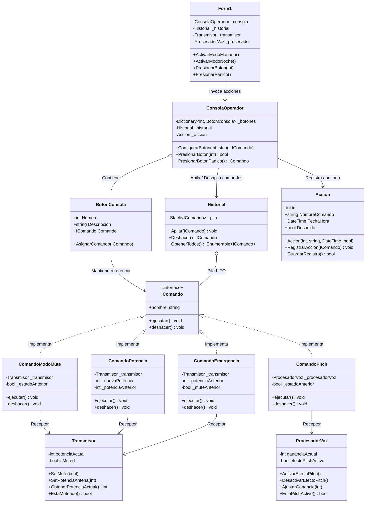

# Patrón de Diseño: Command (Comando) — Consola de Transmisión de Audio

## Problema
Imagina que estás creando una aplicación para una consola de control de una emisora de radio (*broadcast console*). La primera versión de tu aplicación cuenta con una interfaz gráfica donde varios botones de la consola controlan directamente los componentes de hardware del estudio, tales como el transmisor principal de antena (`Transmisor_BLL`) o el procesador digital de voz (`ProcesadorVoz_BLL`).

Al principio todo parece sencillo: en el evento de clic de cada botón escribes directamente llamadas como `transmisor.SetMute(true)` o `procesador.ActivarEfectoPitch()`.

### Añadir nuevos controles y comportamientos provoca un problema
Añadir nuevas formas de interactuar o ampliar las funciones del programa no es tan sencillo si la interfaz gráfica ya está acoplada directamente a las clases concretas de hardware existentes.

Al poco tiempo, el equipo de producción de la radio solicita mejoras indispensables:
1. **Múltiples fuentes de invocación**: Se necesita incorporar atajos de teclado (`1..4`), un pedal de suelo (`Tecla P / Espacio`) y botones en pantalla para que el locutor pueda silenciar el micrófono o activar efectos rápidamente. Si la interfaz ya contenía la lógica de mute directamente en un botón, tendrías que duplicar ese código dentro del manejador del pedal y de los eventos de teclado.
2. **Reconfiguración dinámica de turnos (Hot-Swap)**: La emisora emite programas con necesidades completamente distintas: durante el *Turno Mañana* (noticias y entrevistas) los botones deben activar filtros de distorsión para testimonios anónimos y potencia reducida de 50 W, mientras que durante el *Turno Noche* (música electrónica / DJ) los mismos botones deben activar filtros musicales y potencia máxima de 100 W. Para soportar esto en la interfaz, tendrías que llenar el código con estructuras `if/else` o `switch` que consulten en qué turno se encuentra la consola en cada interacción.
3. **Función de Deshacer (Undo / Rollback de Emergencia)**: Si el operador comete un error al aire (por ejemplo, un corte accidental de señal o una modulación incorrecta), debe poder presionar `Ctrl+Z` o un botón de reversión y restaurar instantáneamente el estado anterior del hardware. Sin un registro desacoplado de las acciones, la interfaz gráfica tendría que recordar y rastrear manualmente el estado histórico previo de cada receptor de audio, violando el principio de responsabilidad única.

Al final acabarás con un código bastante sucio, con una interfaz gráfica fuertemente acoplada a las clases de hardware, plagada de condicionales y con nula capacidad de extensión o reversión ordenada.

---

## Solución
El patrón **Command** sugiere que, en lugar de que la interfaz de usuario (el invocador) envíe solicitudes y órdenes directamente a los objetos de negocio o hardware (los receptores), se extraigan todos los detalles de la solicitud —como el objeto receptor, el método a ejecutar y los argumentos necesarios— y se encapsulen dentro de una clase separada llamada **comando**.

### La estructura de las clases de comando
Todas las operaciones se transforman en objetos autónomos que comparten una interfaz común.

A simple vista, puede parecer que este cambio no tiene sentido, ya que tan solo hemos cambiado el lugar desde donde invocamos a los métodos del transmisor o del procesador de voz. Sin embargo, piensa en esto: ahora puedes parametrizar botones con diferentes comandos, reasignarlos dinámicamente en tiempo de ejecución, encolarlos, registrarlos en auditoría o almacenarlos en una estructura de historial para revertirlos.

No obstante, hay una regla fundamental: todos los comandos deben seguir una interfaz común (en nuestro caso, `IComando`), que declara tanto el método de ejecución (`ejecutar()`) como el método de compensación inversa (`deshacer()`).

### La estructura de la jerarquía de comandos
Cada comando encapsula la llamada al receptor correspondiente y almacena el estado previo necesario para su restauración.

Por ejemplo, tanto la clase `ComandoModoMuteS` como la clase `ComandoPotenciaS` deben implementar la interfaz `IComando`. Cada comando implementa sus métodos de forma especializada:
- `ComandoModoMuteS`: consulta el estado de silencio del `Transmisor_BLL`, lo almacena internamente en `_estadoAnterior` y alterna el silencio. Al invocar `deshacer()`, restaura exactamente el valor que existía previamente.
- `ComandoPotenciaS`: almacena la potencia previa en vatios (`_potenciaAnterior`) y fija la nueva potencia solicitada (ej. 50 W o 100 W). Al deshacer, regresa la antena a la potencia previa.
- `ComandoPitchS`: conmuta el modulador de frecuencia en `ProcesadorVoz_BLL` y guarda el estado anterior para revertir el efecto.
- `ComandoEmergenciaS`: realiza un corte total (potencia a 0 W y mute activado), guardando ambos parámetros previos para restaurar la transmisión completa.

### La estructura del código tras aplicar el patrón Command
Siempre y cuando todas las clases de comando implementen la interfaz común `IComando`, podrás asociarlas a los botones de la consola sin descomponer la interfaz ni acoplarla al hardware.

El código que utiliza los comandos (el invocador, representado por `ConsolaOperador` y cada `BotonConsola`) no encuentra diferencias entre los distintos comandos y trata a todos polimórficamente a través de la interfaz `IComando`. La consola sabe que al pulsar un botón debe llamar a `comando.ejecutar()`, pero no necesita saber cómo funciona el transmisor ni qué circuitos altera:
1. **Desacoplamiento total**: Los botones de la consola desconocen las clases `Transmisor_BLL` y `ProcesadorVoz_BLL`.
2. **Reconfiguración en caliente**: Cambiar entre el *Turno Mañana* y el *Turno Noche* solo requiere reasignar los objetos comando en los slots de la consola (`ConfigurarBoton`), sin modificar la interfaz de usuario ni las clases de negocio.
3. **Historial y Deshacer ilimitado**: Cada vez que se ejecuta una acción, la consola apila el comando en un `Historial` (`Stack<IComando>`). Al solicitar una reversión (`deshacer()`), se desapila el último comando del tope y se invoca su método inverso, restaurando el hardware sin que la consola conozca los detalles técnicos.

---

## Estructura
La estructura del patrón **Command** implementada en este ejercicio:

### Diagrama de Clases de la Solución

### 1. La Interfaz Comando (`IComando`)
Declara la interfaz común para todas las operaciones ejecutables por los invocadores. En este proyecto define:
- `ejecutar()`: Desencadena la acción sobre el receptor.
- `deshacer()`: Revierte el estado del receptor a su condición inmediatamente anterior.
- `nombre`: Propiedad de solo lectura para identificar la acción en auditoría e interfaz.

### 2. Los Comandos Concretos (`ComandoModoMute`, `ComandoPitch`, `ComandoPotencia`, `ComandoEmergencia`)
Son distintas implementaciones de la interfaz `IComando`. No realizan el trabajo técnico directamente por sí mismos; en su lugar, delegan la llamada a los métodos específicos de los receptores correspondientes (`Transmisor` o `ProcesadorVoz`).
Además, capturan y almacenan el estado previo del receptor (`_estadoAnterior`, `_potenciaAnterior`, `_muteAnterior`) justo antes de aplicar la modificación, garantizando que el método `deshacer()` pueda restaurar dicho estado con exactitud.

### 3. La clase Invocadora (`ConsolaOperador` y `BotonConsola`)
Es responsable de iniciar las solicitudes. La consola gestiona los botones físicos o lógicos (`BotonConsola`), donde cada uno mantiene una referencia a un objeto `IComando`.
Cuando el operador presiona un botón o utiliza un atajo, el invocador dispara `boton.Comando.ejecutar()`, añade el comando a la pila de historial y envía el registro a la entidad de auditoría unificada (`Accion`).
Observa que la clase invocadora no tiene conocimiento de los receptores ni de los detalles de audio o transmisión; su única responsabilidad es orquestar la ejecución del comando asignado.

### 4. Los Receptores (`Transmisor` y `ProcesadorVoz`)
Contienen la verdadera lógica de operaciones directas sobre el hardware de transmisión:
- `Transmisor`: Gestiona el encendido/silencio (`SetMute`) y los niveles de potencia RF en vatios (`SetPotenciaAntena`).
- `ProcesadorVoz`: Activa y desactiva el modulador de tono de voz (`ActivarEfectoPitch` / `DesactivarEfectoPitch`) y ajusta decibelios de ganancia.

Cualquier clase puede actuar como receptor. Los comandos actúan como puentes desacoplados entre las solicitudes del invocador y los métodos de estos receptores.

### 5. Entidad General Unificada (`Accion`)
Modela de forma unificada tanto los datos de auditoría (`id`, `NombreComando`, `FechaHora`, `Desacido`) como los métodos de registro y guardado (`RegistrarAccion`, `GuardarRegistro`), simplificando el modelo en una sola clase general sin dispersión por capas.

### 6. El Historial de Ejecución (`Historial`)
Mantiene una colección ordenada en forma de pila LIFO (`Stack<IComando>`). Cada vez que un comando es ejecutado por la consola, se coloca en el tope de la pila mediante `Apilar()`. Cuando se solicita una reversión (Botón de Deshacer / `Ctrl+Z`), se extrae el comando en el tope mediante `Deshacer()` (`Pop()`) y se invoca su método `deshacer()`, permitiendo revertir operaciones en orden inverso sin que la interfaz gráfica guarde variables de estado.

### 7. El Cliente y la Interfaz Gráfica (`Form1`, `Program`)
Crea e inicializa los receptores, instancia los comandos concretos vinculándoles sus receptores correspondientes y los asigna a la consola operadora. 
Permite la reconfiguración dinámica en tiempo de ejecución: al pulsar *Turno Mañana* o *Turno Noche*, el cliente reasigna nuevos comandos a los slots existentes de la consola, logrando un comportamiento completamente distinto sin alterar la estructura interna de las clases ni de la interfaz.

---

## Documentación Teórica del Proyecto

- [Patrón de Diseño: Template Method](file:///c:/Users/Danie/Desktop/GIT/Command_EJ2/PATRON_TEMPLATE.md): Teoría, ventajas y desventajas, diagrama de clases general en Mermaid y tabla comparativa.
- [Patrón de Diseño: Command](file:///c:/Users/Danie/Desktop/GIT/Command_EJ2/PATRON_COMMAND.md): Teoría y funcionalidad (2.1), ventajas y desventajas (2.2) y diagrama de clases general en Mermaid (2.3).
- **Diagrama Enterprise Architect**: Archivo de modelado [Command_EJ2.EAP](file:///c:/Users/Danie/Desktop/GIT/Command_EJ2/Diagrama/Command_EJ2.EAP) y su exportación gráfica en alta resolución [diagrama_clases_general.png](file:///c:/Users/Danie/Desktop/GIT/Command_EJ2/Diagrama/diagrama_clases_general.png).