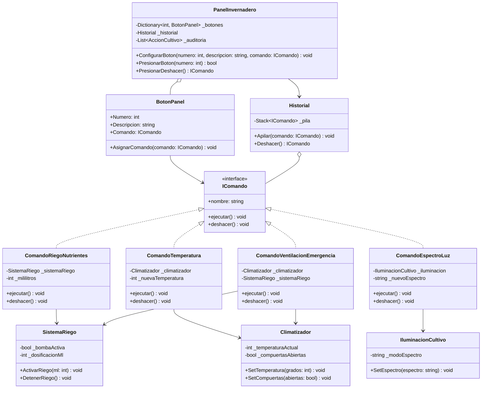

# Patrón de Diseño: Command (Invernadero Hidropónico Automatizado)

Documento técnico del **Patrón Command** aplicado al sistema de control y climatización de precisión para agricultura hidropónica.

---

## 2.1. Teoría y Funcionalidad del Patrón Command

El patrón **Command** (Comando) pertenece a la categoría de patrones de comportamiento. Su propósito central es **encapsular una solicitud como un objeto**, permitiendo parametrizar clientes con diferentes operaciones, poner solicitudes en cola, registrar historiales de ejecución y brindar soporte nativo para operaciones reversibles (**Deshacer / Undo**).

### El Dilema del Acoplamiento en Sistemas Agronómicos
En sistemas de automatización de cultivos, la tentación habitual es conectar los eventos de la interfaz de usuario directamente con los actuadores de hardware. Si el botón `btnAumentarCalor` llama directamente a `calefactor.IncrementarPotencia()`, surgen tres limitaciones críticas:
1. **Acoplamiento Directo**: La UI conoce todos los métodos y peculiaridades técnicas de los receptores.
2. **Rigidez de Configuración**: No se puede cambiar lo que hace un botón sin modificar el código fuente de la UI.
3. **Pérdida de Historial y Reversibilidad**: Para revertir una acción, la UI debería recordar el estado de cada válvula, compuerta y lámpara, rompiendo el principio de responsabilidad única.

### La Solución Funcional del Patrón Command
El patrón Command intercala una capa abstracta entre el emisor de la orden (invocador) y quien ejecuta el trabajo técnico (receptor):

1. **El Invocador (`PanelInvernadero`)**: Conoce únicamente la interfaz abstracta `IComando`. Al recibir un estímulo (clic o atajo de teclado), invoca `comando.ejecutar()`. No sabe ni le interesa qué hardware se accionará.
2. **El Comando (`IComando`)**: Objeto que empaqueta la referencia al receptor correspondiente y los parámetros necesarios para la acción. Almacena en sus campos privados el estado previo para poder restaurarlo con precisión mediante `deshacer()`.
3. **El Receptor (`Climatizador`, `SistemaRiego`, `IluminacionCultivo`)**: Contiene la lógica operativa especializada que interactúa con los sensores y actuadores físicos del invernadero.
4. **El Historial (`Historial`)**: Mantiene una estructura de pila LIFO (`Stack<IComando>`) donde se acumulan los comandos ejecutados. Al solicitar *Deshacer*, se extrae el comando en el tope y se ejecuta `deshacer()`.

---

## 2.2. Ventajas y Desventajas del Patrón Command

### Ventajas
| Ventaja | Impacto en la Solución |
| :--- | :--- |
| **Desacoplamiento Total** | La interfaz gráfica no conoce los detalles internos ni los métodos directos de las bombas o climatizadores. |
| **Soporte Nativo para Rollback (Undo)** | Cada comando concreto almacena el estado previo al ejecutarse (`_tempPrevia`, `_mlPrevio`), permitiendo restaurar el entorno sin almacenar instantáneas completas de la memoria. |
| **Reconfiguración Dinámica de Botones** | Permite alternar perfiles de cultivo (Fase Vegetativa vs. Fase Floración) reasignando los comandos de los slots en tiempo de ejecución. |
| **Principio de Responsabilidad Única (SRP)** | Separa las clases que disparan operaciones de las clases que ejecutan la lógica técnica de hardware. |
| **Principio Abierto/Cerrado (OCP)** | Se pueden incorporar nuevos comandos (como inyección de CO2 o control de humedad) sin modificar el invocador ni la UI. |

### Desventajas
| Desventaja | Impacto en la Solución |
| :--- | :--- |
| **Mayor Número de Clases** | Cada operación específica requiere crear una clase que implemente `IComando`, incrementando el número de archivos en el proyecto. |
| **Capa de Indirección** | Introduce un salto adicional entre el evento de la interfaz y la ejecución en el receptor, lo que exige una arquitectura clara. |

---

## 2.3. Diagrama de Clases y Estructura

