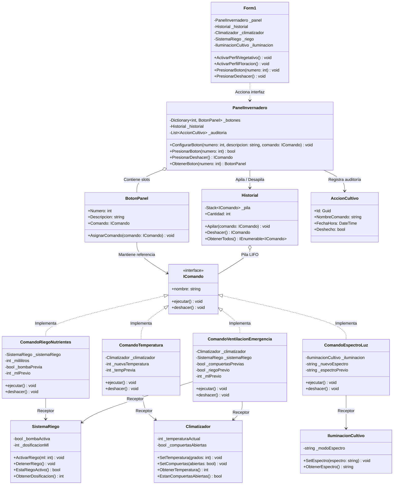

# Controlador de Invernadero Hidropónico Automatizado (Patrón Command)

Sistema de gestión ambiental y fertirriego para cultivos hidropónicos de precisión, implementado en **C# .NET 8 (Windows Forms)** aplicando el patrón de diseño de comportamiento **Command**.

---

## Enunciado del Proyecto

En instalaciones avanzadas de agricultura de precisión en domos cerrados, el crecimiento óptimo de hortalizas hidropónicas depende de tres variables críticas: la **temperatura ambiental**, la **dosificación de sales minerales en el riego** y el **espectro fototrópico de la iluminación LED**.

Se requiere una consola de control para el operario agronómico que permita accionar rutinas sobre los actuadores mediante botones rápidos configurables, alternar perfiles de cultivo (fase de crecimiento vegetativo vs. fase de floración) y, fundamentalmente, disponer de un mecanismo de **reversión inmediata (Deshacer / Undo)** con pila LIFO para neutralizar rápidamente errores de dosificación o temperatura antes de dañar los cultivos.

---

## Problema

Imagina que desarrollas el software de control para un domo hidropónico comercial. En la primera versión, cada botón de la interfaz gráfica invocaba directamente los métodos de los controladores de hardware:

```csharp
// Acoplamiento rígido inicial sin patrón Command:
private void btnRiego_Click(object sender, EventArgs e)
{
    _bombaRiego.ActivarBomba(200);
}

private void btnTemperatura_Click(object sender, EventArgs e)
{
    _termostato.AjustarCalefactor(28);
}
```

Al cabo de poco tiempo, la empresa comienza a escalar y surgen problemas estructurales insostenibles:

1. **Acoplamiento rígido entre UI y actuadores**: El formulario dependía de cada clase concreta de hardware (`Climatizador`, `SistemaRiego`, `IluminacionCultivo`). Cualquier cambio en los parámetros de los equipos obligaba a reescribir la capa visual.
2. **Imposibilidad de reconfigurar los botones dinámicamente**: En agronomía, las plantas requieren un régimen lumínico y nutricional completamente distinto en la **fase vegetativa** (luz azul de 450 nm, riego moderado, 22 °C) que en la **fase de floración** (luz roja profunda de 660 nm, fertirriego reforzado, 26 °C). Sin una abstracción intermedia, cambiar los botones de la consola requería condicionales `if/switch` interminables.
3. **Falta de soporte para Deshacer (Undo / Rollback)**: Un operario que accidentalmente sobrecalienta el domo o inyecta una dosis incorrecta no tenía forma de revertir el cambio a su valor exacto previo sin recordar manualmente el parámetro anterior, arriesgando la pérdida de la cosecha.

---

## Solución

La solución consiste en desacoplar la interfaz gráfica que solicita las acciones de los actuadores técnicos que las ejecutan aplicando el patrón de diseño **Command**.

1. **Encapsulación de Peticiones en Objetos**: Cada operación sobre el invernadero se transforma en una clase independiente (`ComandoRiegoNutrientes`, `ComandoTemperatura`, `ComandoEspectroLuz`, `ComandoVentilacionEmergencia`) que implementa la interfaz común `IComando`.
2. **Capacidad Nativa de Deshacer (`deshacer()`)**: Antes de alterar el receptor, cada comando almacena en campos internos el estado inmediatamente anterior del hardware (por ejemplo, la temperatura previa o si la bomba estaba apagada). Al invocar `deshacer()`, restaura esos valores exactos sin que el resto del sistema deba guardar copias del estado global.
3. **Invocador Desacoplado (`PanelInvernadero`)**: El panel de botones del operador actúa como invocador. Solo conoce objetos `IComando` y dispara `comando.ejecutar()`. No conoce protocolos de bombas, termostatos ni matrices LED.
4. **Historial de Operaciones (Pila LIFO)**: Cada comando ejecutado se apila en un `Historial` (`Stack<IComando>`). Al pulsar *Deshacer* (`Ctrl+Z`), se extrae el comando en el tope (`Pop`) y se ejecuta su método `deshacer()`.

---

## Estructura de la Solución



---

## Componentes del Patrón

1. **Interfaz `IComando`**: Define el contrato unificado con `ejecutar()` y `deshacer()`, permitiendo que el invocador trate cualquier acción ambiental de forma uniforme.
2. **Comandos Concretos**:
   - `ComandoRiegoNutrientes`: Activa ciclos de fertirriego registrando la dosificación previa.
   - `ComandoTemperatura`: Modifica el termostato del domo recordando la temperatura anterior.
   - `ComandoEspectroLuz`: Modifica las longitudes de onda LED recordando el régimen previo.
   - `ComandoVentilacionEmergencia`: Protocolo de seguridad que abre compuertas y corta bombas para evitar daños por asfixia térmica.
3. **Invocador (`PanelInvernadero` y `BotonPanel`)**: Gestiona la interacción con el usuario y dispara los comandos sin acoplarse a los detalles del hardware de cultivo.
4. **Receptores (`Climatizador`, `SistemaRiego`, `IluminacionCultivo`)**: Clases de dominio que controlan los dispositivos electromecánicos del domo.
5. **Historial (`Historial`)**: Pila LIFO que garantiza la reversión exacta de operaciones en orden cronológico inverso.
