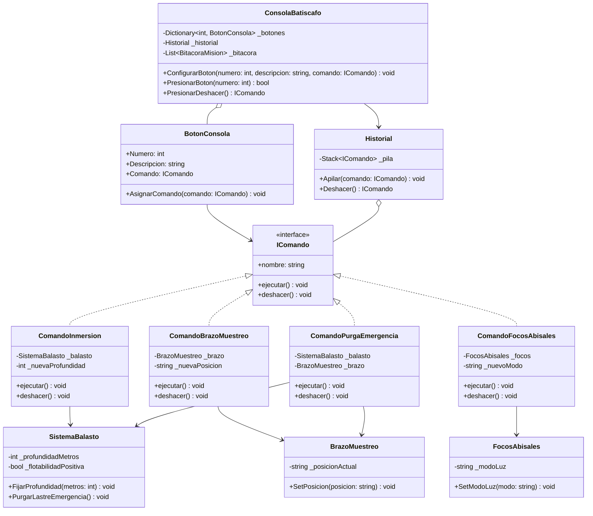

# Patrón de Diseño: Command (Consola de Batiscafo Abisal)

Documento técnico del **Patrón Command** aplicado a la consola de control y maniobra de un batiscafo de exploración oceanográfica profunda.

---

## 2.1. Teoría y Funcionalidad del Patrón Command

El patrón **Command** (Comando) pertenece a la categoría de patrones de comportamiento. Su propósito primordial es **encapsular una solicitud como un objeto**, permitiendo parametrizar objetos con diferentes peticiones, encolar o registrar solicitudes y soportar operaciones reversibles (**Deshacer / Undo**).

### El Dilema del Acoplamiento en Sistemas Submarinos
En sistemas de instrumentación para exploración abisal, vincular de forma directa los botones de la interfaz de usuario con los microcontroladores de válvulas y servomotores genera serias desventajas de arquitectura:
1. **Acoplamiento Directo**: La interfaz de pilotaje queda atada al hardware de cada fabricante.
2. **Falta de Flexibilidad**: No es posible reconfigurar los interruptores de cabina cuando el batiscafo pasa de descender en agua abierta a recolectar rocas en el lecho marino.
3. **Imposibilidad de Reversión Segura**: Si un piloto comete una equivocación bajo presión, la interfaz gráfica no tiene registro histórico del estado anterior de cada subsistema.

### La Solución Funcional del Patrón Command
El patrón Command crea una barrera de desacoplamiento entre el piloto y los sistemas mecánicos:

1. **El Invocador (`ConsolaBatiscafo`)**: Administra los interruptores de cabina (`BotonConsola`) y conoce únicamente la interfaz abstracta `IComando`. Al recibir una interacción, ejecuta `comando.ejecutar()`. No contiene código sobre presión de lastre ni apertura de garras.
2. **El Comando (`IComando`)**: Conecta el botón con el receptor adecuado y guarda en variables privadas el estado inmediatamente anterior del hardware (`_profundidadPrevia`, `_posicionPrevia`). Su método `deshacer()` permite regresar al estado previo exacto.
3. **El Receptor (`SistemaBalasto`, `BrazoMuestreo`, `FocosAbisales`)**: Contiene la lógica física real que gobierna los actuadores de la nave.
4. **El Historial (`Historial`)**: Gestiona la pila LIFO (`Stack<IComando>`) que almacena las maniobras en orden de ejecución, facilitando la reversión paso a paso.

---

## 2.2. Ventajas y Desventajas del Patrón Command

### Ventajas
| Ventaja | Impacto en la Solución |
| :--- | :--- |
| **Desacoplamiento Estricto** | La consola de cabina no contiene referencias directas a bombas ni motores submarinos. |
| **Soporte Nativo para Rollback (Undo)** | Cada comando concreto almacena el estado previo antes de actuar, permitiendo revertir maniobras de manera limpia y segura. |
| **Reconfiguración Dinámica de Mandos** | Permite alternar perfiles de inmersión (*Navegación / Sonar* vs. *Muestreo en Fosa*) reasignando los comandos de los slots en tiempo de ejecución. |
| **Principio de Responsabilidad Única (SRP)** | Separa la clase que inicia la maniobra de la clase que ejecuta la lógica técnica marina. |
| **Extensibilidad (OCP)** | Agregar nuevas herramientas (sensores de salinidad, cámaras 4K) no requiere modificar la consola existente. |

### Desventajas
| Desventaja | Impacto en la Solución |
| :--- | :--- |
| **Proliferación de Clases Concretas** | Cada maniobra específica requiere implementar una nueva clase `IComando`, incrementando el número de archivos. |
| **Capa Adicional de Indirección** | Introduce un objeto intermedio entre la acción del usuario y el método del receptor. |

---

## 2.3. Diagrama de Clases y Estructura

