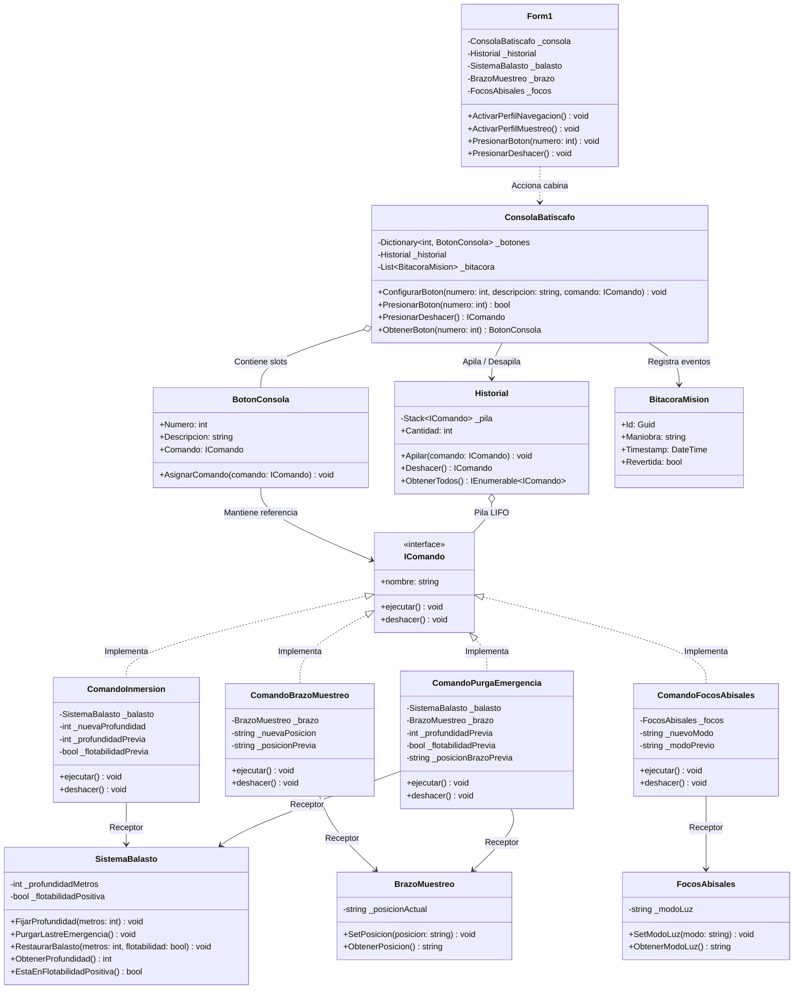

# Consola de Mando de Batiscafo de Exploración Abisal (Patrón Command)

Sistema de control y telemetría de maniobras para un batiscafo científico de inmersión profunda, implementado en **C# .NET 8 (Windows Forms)** aplicando el patrón de diseño de comportamiento **Command**.

---

## Enunciado del Proyecto

En expediciones oceanográficas a fosas abisales (por encima de los 3.000 metros de profundidad), el piloto científico opera una cápsula de investigación de titanio gobernando tres subsistemas mecánicos críticos: el **sistema de tanques de balasto e inmersión**, la **pinza robótica de muestreo de sedimentos** y los **focos halógenos de alta penetración**.

Se requiere una consola de mando que permita al piloto accionar maniobras mediante interruptores configurables en cabina, alternar perfiles de misión (*Régimen de Navegación/Sonar* vs. *Régimen de Muestreo en Lecho Marino*) y disponer de un mecanismo de **reversión inmediata de maniobras (Deshacer / Undo)** con pila LIFO para abortar o retrotraer con precisión cualquier maniobra en caso de riesgo de colisión o sobrepresión.

---

## Problema

En las primeras versiones del software de navegación del batiscafo, los botones de la cabina disparaban directamente las rutinas de los actuadores electromecánicos:

```csharp
// Acoplamiento inicial sin patrón Command:
private void btnDescenso_Click(object sender, EventArgs e)
{
    _sistemaBalasto.InundarTanques(3000);
}

private void btnBrazo_Click(object sender, EventArgs e)
{
    _brazoMecanico.ExtenderGarra();
}
```

Este enfoque generó deficiencias operativas intolerables a profundidades extremas:

1. **Acoplamiento rígido entre cabina y actuadores**: El software de la consola dependía estrechamente de las clases de hardware (`SistemaBalasto`, `BrazoMuestreo`, `FocosAbisales`), dificultando la incorporación de nuevas herramientas oceanográficas.
2. **Imposibilidad de reconfigurar mandos según la fase de la inmersión**: Durante la navegación crucero o de búsqueda por sonar, el piloto necesita interruptores para encender focos de prospección y mantener el brazo bloqueado contra el casco. Al tocar fondo en una fosa, los mismos interruptores deben reasignarse a iluminación de alta potencia (20.000 lúmenes) y control fino de pinza. Sin un patrón de diseño, alternar regímenes requería condicionales complejos y proclives a fallos.
3. **Ausencia de reversibilidad segura (Rollback)**: En un entorno sin visibilidad y con presiones hidrostáticas superiores a 300 atmósferas, un error humano (por ejemplo, desplegar la pinza a alta velocidad o sobrepasar la cota de profundidad de seguridad) exige una reversión instantánea al estado previo exacto sin forzar al piloto a recordar configuraciones manuales anteriores.

---

## Solución

La arquitectura se resolvió desacoplando la emisión de maniobras del trabajo técnico sobre el hardware marino mediante el patrón **Command**.

1. **Maniobras como Objetos Autónomos**: Cada operación submarina se encapsula en una clase independiente (`ComandoInmersion`, `ComandoBrazoMuestreo`, `ComandoFocosAbisales`, `ComandoPurgaEmergencia`) que implementa la interfaz `IComando`.
2. **Reversión de Maniobras (`deshacer()`)**: Cada comando captura en variables privadas el estado previo de los actuadores antes de aplicar la modificación. Al pulsar *Revertir* (`Ctrl+Z`), se ejecuta `deshacer()`, restaurando el lastre, cota de metros o posición de pinza previa.
3. **Invocador Desacoplado (`ConsolaBatiscafo`)**: La consola administra los slots de interruptores en cabina y solo conoce la interfaz `IComando`. No tiene acoplamiento con bombas hidráulicas, tanques de lastre ni proyectores.
4. **Bitácora LIFO (`Historial`)**: Mantiene una pila `Stack<IComando>` de maniobras ejecutadas. El piloto puede revertir operaciones en orden inverso sin pérdida de coherencia.

---

## Estructura de la Solución



---

## Componentes del Patrón

1. **`IComando`**: Define la interfaz polimórfica para todas las maniobras del batiscafo (`ejecutar()` y `deshacer()`).
2. **Comandos Concretos**:
   - `ComandoInmersion`: Modifica la cota de profundidad en metros recordando la cota anterior.
   - `ComandoBrazoMuestreo`: Opera la garra articulada guardando su posición previa.
   - `ComandoFocosAbisales`: Cambia la intensidad de los proyectores recordando el régimen previo.
   - `ComandoPurgaEmergencia`: Suelta el lastre sólido e inicia ascenso inmediato a superficie bloqueando el brazo contra el casco.
3. **Invocador (`ConsolaBatiscafo` y `BotonConsola`)**: Provee la interfaz de pilotaje desacoplada de la implementación técnica de los actuadores submarinos.
4. **Receptores (`SistemaBalasto`, `BrazoMuestreo`, `FocosAbisales`)**: Clases de dominio que ejecutan el control físico de la cápsula.
5. **Historial (`Historial`)**: Pila LIFO encargada del rollback ordenado de maniobras oceanográficas.
